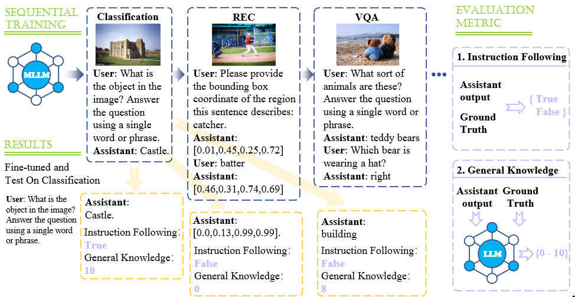

# CoIN: A Benchmark of ContinuaL Instruction tuNing for Multimodel Large Language Model

Cheng Chen, Junchen Zhu, Xu Luo, Hengtao Shen, LianLi Gao, Jingkuan Song.



## Abstract
Instruction tuning represents a prevalent strategy employed by Multimodal Large Language Models (MLLMs) to align with human instructions and adapt to new tasks. Nevertheless, MLLMs encounter the challenge of adapting to users' evolving knowledge and demands. Therefore, how to retain existing skills while acquiring new knowledge needs to be investigated. In this paper, we present a comprehensive benchmark, namely ContinuaL Instruction tuNing (CoIN), to assess existing MLLMs in sequential instruction tuning paradigm. CoIN comprises 10 commonly used datasets spanning 8 task categories, ensuring a diverse range of instructions and tasks. Besides, the trained model is evaluated from two aspects: Instruction Following and General Knowledge, which assess the alignment with human intention and knowledge preserved for reasoning, respectively. Experiments on CoIN demonstrate that current powerful MLLMs still suffer catastrophic forgetting, and the failure in intention alignment assumes the main responsibility, instead of the knowledge forgetting. To this end, we introduce MoELoRA to MLLMs which is effective to retain the previous instruction alignment. Experimental results consistently illustrate the forgetting decreased from this method on CoIN.

## Install
1. Clone this repository and navigate to CoIN folder
``` 
git clone https://github.com/zackschen/CoIN.git
cd CoIN 
```
2. Install Package
```
conda create -n coin python=3.10 -y
conda activate coin
pip install --upgrade pip
pip install -e .
```

3. Install additional packages for training cases
```
pip install -e ".[train]"
pip install flash-attn --no-build-isolation
```

This repo is based on [LLaVA](https://github.com/haotian-liu/LLaVA). 
If you meet a problem, maybe you could find some solutions in issuses.

## Dataset
Please download the images from the constituting dataset: ScienceQA, VQAv2, VizWiz, TextVQA, GQA, OCR-VQA, ImageNet, RefCOCO, RefCOCO+, and RefCOCOg.
|  Image Source   | Download Path  |
|  :----:  | :----:  |
| COCO | [train2014](http://images.cocodataset.org/zips/train2014.zip), [test2015](http://images.cocodataset.org/zips/test2015.zip), [val2014](http://images.cocodataset.org/zips/val2014.zip) |
| RefCOCO  | [annotation](https://bvisionweb1.cs.unc.edu/licheng/referit/data/refcoco.zip) | 
| RefCOCO+  | [annotation](https://bvisionweb1.cs.unc.edu/licheng/referit/data/refcoco+.zip) | 
| RefCOCOg  | [annotation](https://bvisionweb1.cs.unc.edu/licheng/referit/data/refcocog.zip) | 
| ImageNet  | [images](https://image-net.org/challenges/LSVRC/index.php) | 
| OCR-VQA  | [images](https://drive.google.com/drive/folders/1_GYPY5UkUy7HIcR0zq3ZCFgeZN7BAfm_) | 
| GQA  | [images](https://downloads.cs.stanford.edu/nlp/data/gqa/images.zip) | 
| TextVQA  | [train](https://dl.fbaipublicfiles.com/textvqa/images/train_val_images.zip),[test](https://dl.fbaipublicfiles.com/textvqa/images/test_images.zip) | 
| ScienceQA  | [images](https://drive.google.com/drive/folders/1w8imCXWYn2LxajmGeGH_g5DaL2rabHev) | 
| VizWiz  | [train](https://vizwiz.cs.colorado.edu/VizWiz_final/images/train.zip), [val](https://vizwiz.cs.colorado.edu/VizWiz_final/images/val.zip), [test](https://vizwiz.cs.colorado.edu/VizWiz_final/images/test.zip) | 

After downloading all of them, organize the data as follows:
```
├── COCO2014
│   └── train2014
├── GQA
│   └── images
├── OCR-VQA
│   └── images
├── TextVQA
│   └── train_images
│   └── test_images
```

Then, please download the instructions from our datasets path: [CLIT_Dataset](https://huggingface.co/datasets/Zacks-Chen/CLIT/tree/main)
then, organize the instructions as follows:
```
├── Instruction_Type1
│   └── GQA
│       └── train.json
│       └── test.json
│   └── ScienceQA
│       └── train.json
│       └── test.json
├── Instruction_Type2
│   └── GQA
│       └── train.json
│       └── test.json
```

## Instruction Tuning
First, downloading the pretrained projectors in [LLaVA Model_Zoo](https://github.com/haotian-liu/LLaVA/blob/main/docs/MODEL_ZOO.md).

Setting `pretrain_mm_mlp_adapter` to the projector path.
You could modify the `deepspeed config` to change the deepspeed config.

We provide the scripts of our train order in `scripts/CoIN/Train`.
Note, the `output_dir` of the previous script is the `previous_task_model_path` of the next training process.
Then, you could tune these datasets in your order.

### MoELoRA
For training with MoeLoRA, you could train scripts in `scripts/CoIN/Train_MOE`.

## Evaluation
We have prepared the scripts to evaluate the trained model in `scripts/CoIN/Eval`.

## Acknowledgement
[LLaVA](https://github.com/haotian-liu/LLaVA): the codebase we built upon, and our base model LLaVA-1.5-7b that has the amazing vision-language capabilities!
